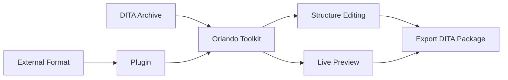
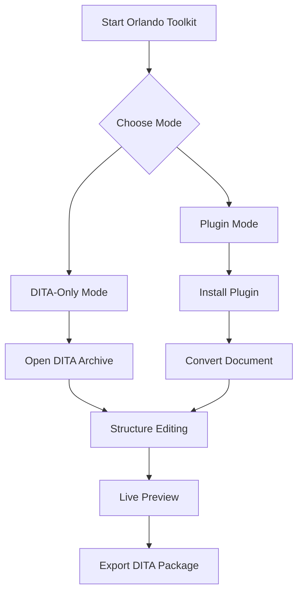

#  Orlando Toolkit

[](LICENSE)
[](#installation)
[](requirements.txt)
[](#overview)

**A focused desktop application for DITA document processing with plugin-based format conversion support.**

---

## Table of Contents

- [Overview](#overview)
- [Installation](#installation)
  - [Quick Install](#quick-install)
  - [From Source](#from-source)
- [Plugin System](#plugin-system)
- [Getting Started](#getting-started)
- [Documentation](#documentation)
- [Support](#support)
- [License](#license)

## Overview

Orlando Toolkit provides a streamlined interface for working with DITA (Darwin Information Typing Architecture) documents.

### Core Features

| Feature | Description |
|---------|-------------|
| **DITA-Only Mode** | Native DITA archive (.zip) processing and editing |
| **Structure Editing** | Visual tree-based topic and section management |
| **Live Preview** | Real-time DITA document rendering |
| **Plugin Architecture** | Extensible format conversion via plugins |

### Supported Workflows



- **Open and edit** existing DITA archives
- **Import** from external formats (via plugins)
- **Structure manipulation** and topic organization
- **Export** ready-to-use DITA packages

## Installation

### Quick Install

Download and run the [**Windows Installer**](https://github.com/Orsso/orlando-toolkit/releases/download/Installer/OTK_Installer.bat)

### From Source

<details>
<summary>Click to expand installation steps</summary>

#### Prerequisites
- Python 3.7 or higher
- Git (for cloning the repository)

#### Steps

1. **Clone the repository**
   ```bash
   git clone https://github.com/Orsso/orlando-toolkit
   cd orlando-toolkit
   ```

2. **Install dependencies**
   ```bash
   python -m pip install -r requirements.txt
   ```

3. **Run the application**
   ```bash
   python run.py
   ```

#### Troubleshooting
- Ensure Python is in your PATH
- On Unix systems, you may need to install additional dependencies
- Check the [Support](#support) section for common issues

</details>

## Plugin System

Orlando Toolkit uses a **plugin architecture** for extensible format conversion. Plugins are installed directly from GitHub repositories.

### Installation Process

| Step | Action |
|------|--------|
| 1 | Open **Plugin Management** from the splash screen |
| 2 | Enter a GitHub repository URL |
| 3 | Click **"Import Plugin"** to download and install |
| 4 | **Activate** the plugin to enable functionality |
| 5 | **Restarting** the app migh be needed for some plugins |

### Available Plugins

<details>
<summary>Official Plugins</summary>

| Plugin | Repository | Description |
|--------|------------|-------------|
| **DOCX Plugin** | [orlando-docx-plugin](https://github.com/orsso/orlando-docx-plugin) | Convert Microsoft Word documents to DITA |
| **Video Library Plugin** | [orlando-video-plugin](https://github.com/orsso/orlando-video-plugin) | Convert video files to DITA with inline preview |

</details>

### Plugin Development

Interested in creating your own plugin? See the [**Plugin Development Guide**](docs/PLUGIN_DEVELOPMENT_GUIDE.md) for detailed instructions.

### Plugin Management

<details>
<summary>Technical Details</summary>

#### Installation Location
- **Unix**: `~/.orlando_toolkit/plugins/`
- **Windows**: `%LOCALAPPDATA%\OrlandoToolkit\plugins`

#### Architecture
- Each plugin is a standalone GitHub repository
- Complete packaging with dependencies
- Version management through repository tags

#### Compatibility Note
> **Warning**: Plugins are primarily tested on Windows. Unix-based systems may require additional configuration. 	¯\_(ツ)_/¯

</details>

## Getting Started

### Quick Start Workflow



### Usage Modes

<details>
<summary><strong>DITA-Only Mode</strong> - Work with existing DITA archives</summary>

1. Launch Orlando Toolkit
2. Select **"Process DITA Archive"**
3. Choose your `.zip` DITA archive
4. Edit structure and content
5. Export updated archive

</details>

<details>
<summary><strong>Plugin Mode</strong> - Convert from external formats</summary>

1. **Install required plugins** for your format
2. Select **"Convert Document"**
3. Choose your source file (DOCX, PDF, etc.)
4. Review and edit the conversion
5. Export as DITA archive

</details>

### Key Features

| Feature | Description |
|---------|-------------|
| **Structure Editing** | Use the tree interface to reorganize topics and sections |
| **Live Preview** | See changes in real-time |
| **Export** | Generate complete DITA packages for downstream publishing |

## Documentation

### User Documentation

| Document | Description |
|----------|-------------|
| [**User Guide**](docs/user_guide.md) | Complete guide for end users |
| [**Installation Guide**](#installation) | Setup and installation instructions |

### Developer Documentation

| Document | Description |
|----------|-------------|
| [**Plugin Development Guide**](docs/PLUGIN_DEVELOPMENT_GUIDE.md) | Build your own format converters |
| [**Architecture Overview**](docs/architecture_overview.md) | System architecture and design |
| [**Runtime Flow**](docs/runtime_flow.md) | Application execution flow |

### Technical Documentation

| Component | Documentation |
|-----------|---------------|
| **Core** | [orlando_toolkit/core/README.md](orlando_toolkit/core/README.md) |
| **UI** | [orlando_toolkit/ui/README.md](orlando_toolkit/ui/README.md) |
| **Configuration** | [orlando_toolkit/config/README.md](orlando_toolkit/config/README.md) |

## Support

### Getting Help

| Resource | Purpose |
|----------|----------|
| [**GitHub Issues**](https://github.com/Orsso/orlando-toolkit/issues) | Report bugs and request features |
| [**GitHub Discussions**](https://github.com/Orsso/orlando-toolkit/discussions) | Community support and questions |
| [**Documentation**](#documentation) | Comprehensive guides and references |

### Contributing

Contributions are welcome! Please see documentation for:
- [Plugin Development](docs/PLUGIN_DEVELOPMENT_GUIDE.md)
- [Architecture Overview](docs/architecture_overview.md)

---

## License

**MIT License** — see [`LICENSE`](LICENSE) for full text.

### Disclaimer

Orlando Toolkit is an independent, open-source project and is not affiliated with "Orlando TechPubs" or Infotel. "Orlando" may be a trademark of its owner; references are for identification only.
