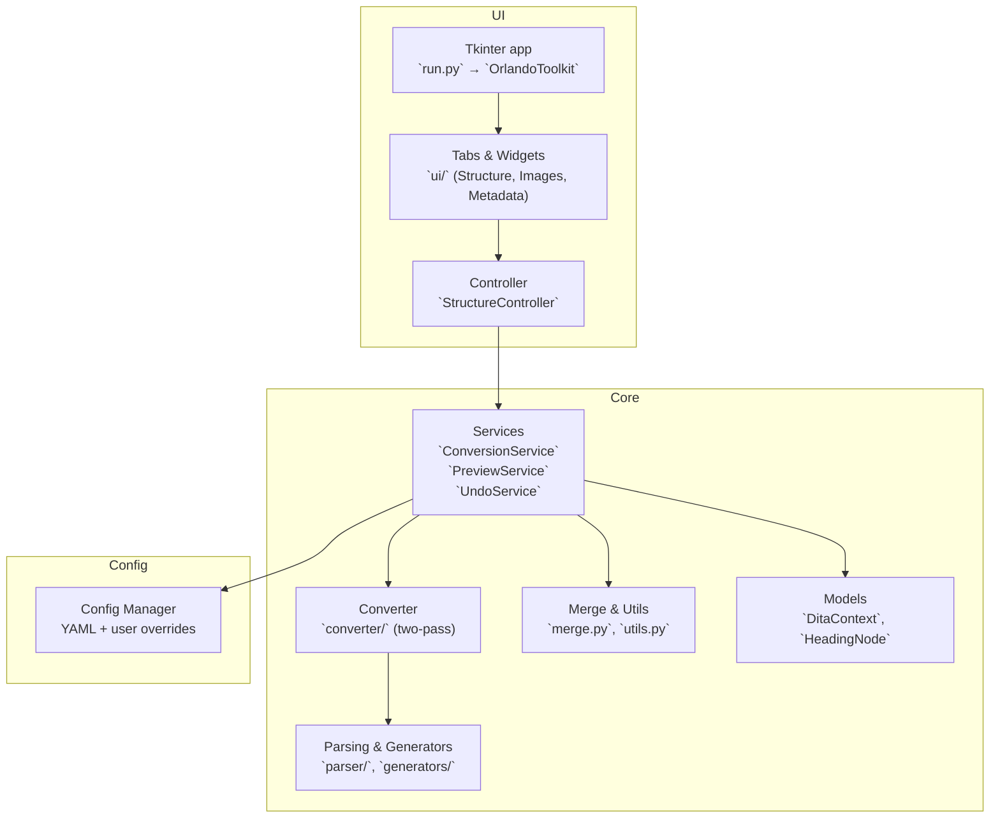

## Orlando Toolkit — Architecture Overview

---

- UI overview: see `orlando_toolkit/app.py` and `orlando_toolkit/ui/`
- Core processing: see `orlando_toolkit/core/` and its [README](../orlando_toolkit/core/README.md)
- Configuration: see `orlando_toolkit/config/` and its [README](../orlando_toolkit/config/README.md)
- End-to-end runtime: see [Runtime Flow](runtime_flow.md)

---

## 1. High-level architecture



Key properties:
- UI is a thin layer. Business logic lives in services (`core/services/`).
- Core conversion is I/O-free (operates in-memory) until packaging.
- Configuration is optional and layered: packaged defaults + user overrides; safe fallbacks when YAML isn’t available.

---

## 2. Code layout (grounded in repo)

```
orlando_toolkit/
  app.py                 # Tk-based app, home → summary → main tabs
  logging_config.py      # DictConfig + rotating file handler (logs/app.log)
  core/
    models/              # DitaContext, HeadingNode
    parser/              # WordprocessingML traversal, style analysis
    converter/           # Two-pass DOCX→DITA + packaging helpers
    generators/          # XML builders (tables, etc.)
    preview/             # Raw XML + HTML preview (XSLT, temp images)
    services/            # ConversionService, PreviewService, UndoService
    merge.py             # Unified depth/style merge for structure filtering
    utils.py             # Save XML, slugify, ID helpers, etc.
  config/
    manager.py           # YAML loader + user overrides
    default_color_rules.yml  # Packaged default (others fallback to builtin-empty)
  ui/
    controllers/         # `StructureController`
    widgets/             # Structure tree, search, toolbar, preview panel…
    *_tab.py             # Structure / Images / Metadata tabs
```

Related sub-docs:
- Core details: [orlando_toolkit/core/README.md](../orlando_toolkit/core/README.md)
- UI details: [orlando_toolkit/ui/README.md](../orlando_toolkit/ui/README.md)
- Config details: [orlando_toolkit/config/README.md](../orlando_toolkit/config/README.md)

---

## 3. Runtime workflow (current behavior)

Summary of the primary flow (see the full sequence in [Runtime Flow](runtime_flow.md)):
- `run.py` sets up logging, theme, icon, and instantiates `OrlandoToolkit`.
- User selects a `.docx` → `ConversionService.convert()` builds an in-memory `DitaContext` using the two-pass converter.
- The app shows a post-conversion summary on the home screen with counts and inline metadata editing.
- User continues to the main tabs: Structure, Images, Metadata.
- On Export, `ConversionService.prepare_package()` applies unified depth/style filtering and renaming; then `write_package()` saves a `DATA/` tree and zips it.

Notes:
- Structure filtering in the UI uses `StructureEditingService.apply_depth_limit()` under the controller, with undo snapshots via `UndoService`.
- Preview goes through `PreviewService` and `core/preview/xml_compiler.py` (minimal XSLT, temp files for images). Optional `tkinterweb` enables richer HTML; falls back to readable XML/text.

---

## 4. Conversion pipeline (grounded)

Two-pass conversion in `core/converter/`:
- Pass 1: `structure_builder.build_document_structure()` builds a full heading tree (`HeadingNode`) using style and numbering analysis from `parser/style_analyzer.py`.
- Pass 2: `structure_builder.determine_node_roles()` marks nodes as section vs module.
- Generation: `structure_builder.generate_dita_from_structure()` produces a DITA map with `topichead` for sections and concept topics for modules, storing topics and images in `DitaContext`.

Helpers in `converter/helpers.py` handle inline formatting, Wingdings checkbox normalization, and paragraph/table processing. Table XML is created by `generators/dita_builder.py`.

---

## 5. Services and editing

- `ConversionService`
  - `convert(path, metadata)` → `DitaContext`
  - `prepare_package(ctx)` → apply unified depth/style merge (`merge.merge_topics_unified`), prune empties, rename topics/images.
  - `write_package(ctx, output_zip)` → `DATA/` layout and ZIP.
- `PreviewService` → raw XML and HTML preview through `preview/xml_compiler.py`.
- `UndoService` → immutable snapshots of the full `DitaContext` for undo/redo.
- `StructureEditingService` (used via `StructureController`) → move/promote/demote, rename, delete, apply depth/style filters.

Models:
- `DitaContext` now includes helpers to save/restore original structure to make depth filtering reversible in-session.

---

## 6. Configuration (what exists today)

`ConfigManager` loads packaged defaults and merges `~/.orlando_toolkit/*.yml` when present. Safe fallbacks apply if PyYAML is missing.

Available sections and current state:
- `color_rules` → has a packaged default (`default_color_rules.yml`).
- `style_map`, `image_naming`, `logging` → loaded if provided by the user; otherwise empty defaults.

See [orlando_toolkit/config/README.md](../orlando_toolkit/config/README.md).

---

## 7. Packaging and resources

- No DTDs are embedded. Files declare standard PUBLIC identifiers (e.g., `map.dtd`, `concept.dtd`) and rely on the target toolchain’s catalog.
- Output layout:
  - `DATA/topics/` — generated topics
  - `DATA/media/` — extracted images
  - `DATA/<manual_code>.ditamap` — root map

---

## 8. Build & distribution

- Windows executable: `build_exe.py` (PyInstaller, windowed) and `build.bat` convenience script.
- From source: `python run.py` after installing `requirements.txt`.

---

## 9. Links

- Runtime flow: [docs/runtime_flow.md](runtime_flow.md)
- Core guide: [orlando_toolkit/core/README.md](../orlando_toolkit/core/README.md)
- UI guide: [orlando_toolkit/ui/README.md](../orlando_toolkit/ui/README.md)
- Config guide: [orlando_toolkit/config/README.md](../orlando_toolkit/config/README.md)

