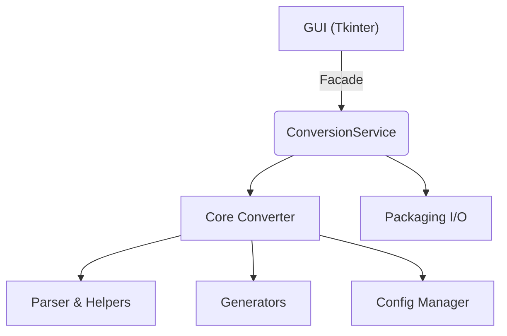

# Orlando Toolkit – Architecture Overview

---

## 1 Introduction

Orlando Toolkit converts structured Microsoft Word manuals to standalone DITA projects and bundles them as ready-to-publish ZIP archives. The codebase follows a classic layered architecture:



Each layer is import-only towards those below it, giving us clear dependency boundaries and facilitating unit-testing.

---

## 2 Package structure

```
orlando_toolkit/
    app.py                 # GUI entry-point widget (Tk)
    logging_config.py      # Centralised logging setup
    core/
        models/            # Immutable data structures (DitaContext, HeadingNode)
        parser/            # WordprocessingML traversal utilities
        converter/         # DOCX→DITA conversion logic + packaging helpers
        generators/        # XML builders (tables etc.) kept separate from the main algorithm for clarity
        preview/           # Read-only XML/HTML preview utilities
        services/          # Business-logic façade (ConversionService)
        merge.py           # Depth/style-based merging helpers for structure filtering
        utils.py           # Helper utilities (slugify, XML save, colour mapping)
    config/
        manager.py         # YAML loader + runtime overrides
        default_color_rules.yml
    ui/                    # Tkinter tabs/widgets
```

Runtime artefacts
* Logs are written to `./logs/` (overridable with `$ORLANDO_LOG_DIR`).
* Temporary build folders are created under the OS temp directory and removed automatically.

---

## 3 Runtime workflow

1. `run.py` initialises logging and instantiates `app.OrlandoToolkit`.
2. The user selects a `.docx`; the GUI calls
   ```python
   ConversionService().convert(docx_path, metadata)
   ```
3. The service delegates to `core.converter.convert_docx_to_dita()` which:
   * extracts images and headings via `core.parser.*`,
   * emits DITA topics/maps through the generators, and
   * fills a `DitaContext` with in-memory XML trees and blobs.
4. On "Generate package" the service
   * renames topics and images (stable IDs), and
   * writes a zipped archive to the chosen path.

Errors propagate as exceptions. The GUI shows message boxes; future CLI wrappers will map them to exit codes.

---

## 4 Core components

| Module | Purpose |
|--------|---------|
| `models.DitaContext` | Immutable container for topics, images, ditamap & metadata. |
| `parser.docx_utils`  | Streaming traversal of Word blocks + image extraction. |
| `parser.style_analyzer` | Infers heading levels from DOCX style/numbering definitions. |
| `converter.docx_to_dita` | Main algorithm; stateless, pure-function style. |
| `converter.helpers`  | Small utilities migrated from legacy script to keep `docx_to_dita` lean. |
| `generators.dita_builder` | XML builders for tables (Phase 3 extraction). |
| `services.conversion_service` | Orchestrates end-to-end workflow and filesystem I/O. |
| `merge.merge_topics_unified` | Unified depth/style merge for structure filtering (used by Structure tab and export). |

---

## 5 Configuration

`ConfigManager` looks for YAML files packaged within the wheel **and** user overrides under `~/.orlando_toolkit/`. Sections:
* `style_map`         – overrides for Word style → heading level.
* `color_rules`       – text-colour → outputclass mapping.
* `image_naming`      – future: custom image naming templates.
* `logging`           – optional `logging.yml` applied via `logging.config.dictConfig()`.

If PyYAML is missing, built-in defaults guarantee the application still runs.

---

## 6 Resources

Generated packages do not embed DTDs or ditaval files. XML documents declare standard PUBLIC identifiers (e.g., concept.dtd, map.dtd) and rely on the target toolchain's catalog to resolve them. No `dtd_package` is bundled or copied during packaging.

---

## 7 Build & distribution

* **Windows executable** – `build_exe.py` calls PyInstaller in
  single-file, windowed mode, bundling application assets (icon/theme) only.
* **Source distribution** – `python -m build` produces a PEP 517 wheel; no C-extensions.


---

## 8 Extension points / future work

* Headless CLI wrapper (non-Tk).
* Plugin system for custom image naming schemes.


---

