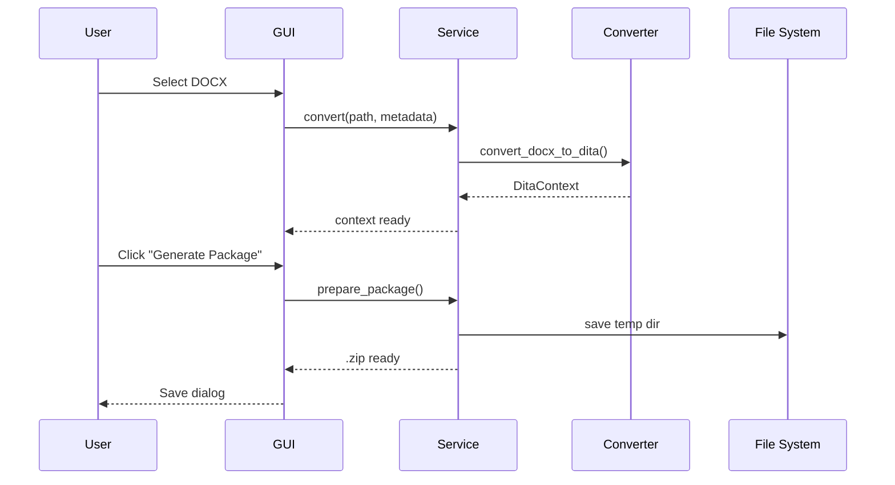

# Runtime Flow

```mermaid
sequenceDiagram
    participant User
    participant GUI
    participant Service
    participant Converter
    participant FS as File System

    User->>GUI: Select DOCX
    GUI->>Service: convert(path, metadata)
    Service->>Converter: convert_docx_to_dita()
    Converter-->>Service: DitaContext
    Service-->>GUI: context ready
    User->>GUI: Click "Generate Package"
    GUI->>Service: prepare_package()
    Service->>FS: save temp dir
    Service-->>GUI: .zip ready
    GUI-->>User: Save dialog
```

