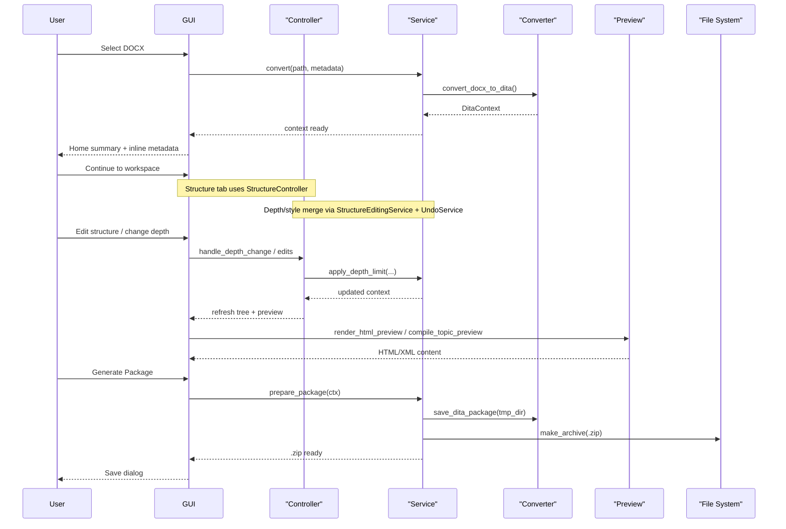

# Runtime Flow

```mermaid
sequenceDiagram
    participant User
    participant GUI
    participant Ctrl as "Controller"
    participant Svc as "Service"
    participant Conv as "Converter"
    participant Prev as "Preview"
    participant FS as "File System"

    User->>GUI: Select DOCX
    GUI->>Svc: convert(path, metadata)
    Svc->>Conv: convert_docx_to_dita()
    Conv-->>Svc: DitaContext
    Svc-->>GUI: context ready
    GUI-->>User: Home summary + inline metadata
    User->>GUI: Continue to workspace
    Note over GUI,Ctrl: Structure tab uses StructureController
    Note over Ctrl,Svc: Depth/style merge via StructureEditingService + UndoService
    User->>GUI: Edit structure / change depth
    GUI->>Ctrl: handle_depth_change / edits
    Ctrl->>Svc: apply_depth_limit(...)
    Svc-->>Ctrl: updated context
    Ctrl-->>GUI: refresh tree + preview
    GUI->>Prev: render_html_preview / compile_topic_preview
    Prev-->>GUI: HTML/XML content
    User->>GUI: Generate Package
    GUI->>Svc: prepare_package(ctx)
    Svc->>Conv: save_dita_package(tmp_dir)
    Svc->>FS: make_archive(.zip)
    Svc-->>GUI: .zip ready
    GUI-->>User: Save dialog
```

