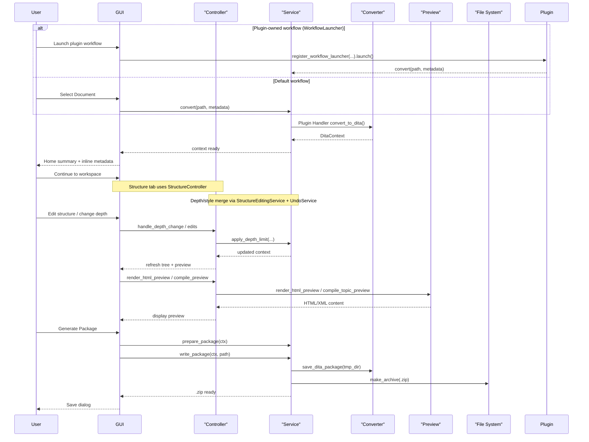

# Runtime Flow

Notes:
- When a plugin registers a WorkflowLauncher, it owns file selection and progress. On success it must call app_ui.on_conversion_success(context). Otherwise, the default flow applies.

