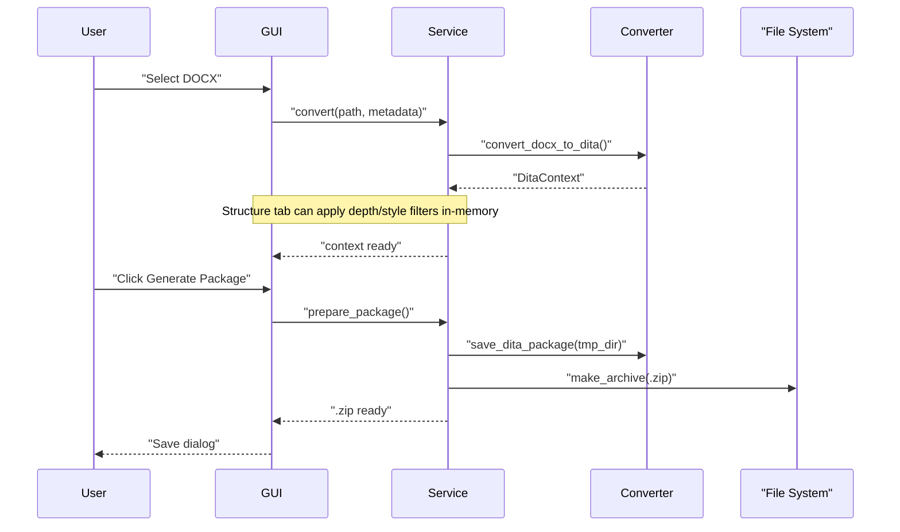

# Runtime Flow

```mermaid
sequenceDiagram
    participant User
    participant GUI
    participant Service
    participant Converter
    participant FS as "File System"

    User->>GUI: "Select DOCX"
    GUI->>Service: "convert(path, metadata)"
    Service->>Converter: "convert_docx_to_dita()"
    Converter-->>Service: "DitaContext"
    Note over GUI,Service: Structure tab can apply depth/style filters in-memory
    Service-->>GUI: "context ready"
    User->>GUI: "Click Generate Package"
    GUI->>Service: "prepare_package()"
    Service->>Converter: "save_dita_package(tmp_dir)"
    Service->>FS: "make_archive(.zip)"
    Service-->>GUI: ".zip ready"
    GUI-->>User: "Save dialog"
```

