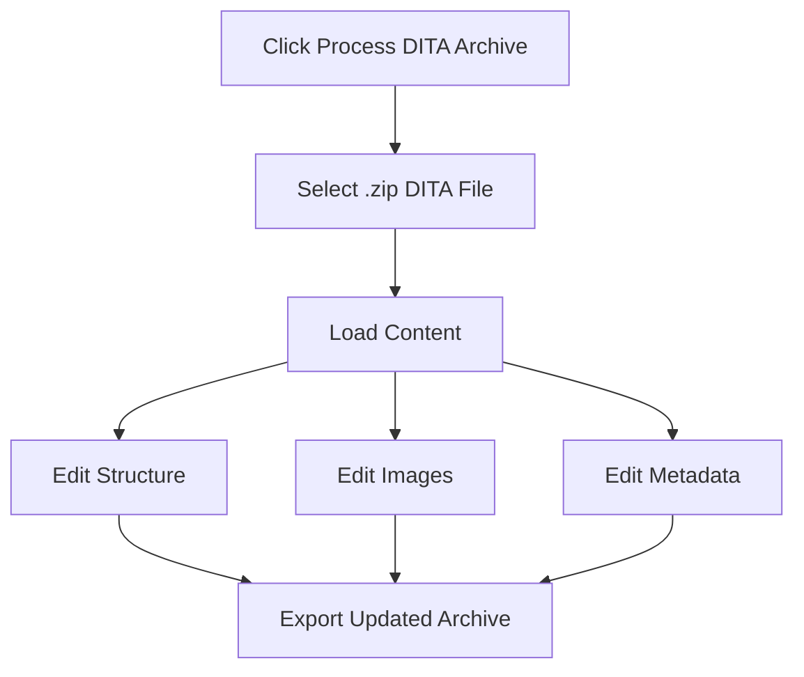
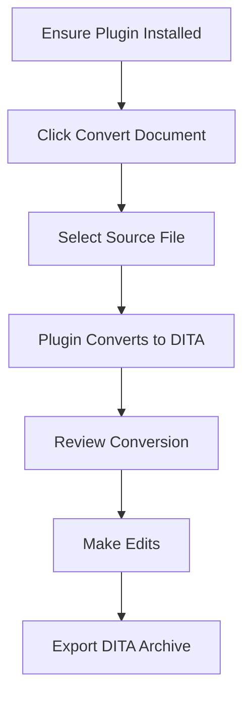

# Orlando Toolkit User Guide

[](../README.md)

## Table of Contents

- [Overview](#overview)
- [Getting Started](#getting-started)
  - [Installation](#installation)
  - [Plugin Management](#plugin-management)
- [Using Orlando Toolkit](#using-orlando-toolkit)
  - [Processing Documents](#processing-documents)
  - [Working with Structure](#working-with-structure)
  - [Images and Metadata](#images-and-metadata)
  - [Export](#export)
- [Plugin Ecosystem](#plugin-ecosystem)
- [Troubleshooting](#troubleshooting)
- [Configuration](#configuration)

---

## Overview

Orlando Toolkit is a **DITA document processor** with plugin-based format conversion. Process DITA archives directly or install plugins to convert from other formats.

## Getting Started

### Installation

#### Option 1: Windows Executable (Recommended)

| Step | Action |
|------|--------|
| 1 | Download the [Windows Installer](https://github.com/Orsso/orlando-toolkit/releases/download/Installer/OTK_Installer.bat) |
| 2 | Run the installer |
| 3 | Launch from desktop shortcut |

#### Option 2: From Source

<details>
<summary>Click to expand source installation steps</summary>

**Prerequisites:**
- Python 3.7+
- Git

**Steps:**
```bash
# Clone the repository
git clone https://github.com/Orsso/orlando-toolkit
cd orlando-toolkit

# Install dependencies
pip install -r requirements.txt

# Run the application
python run.py
```

</details>

### Plugin Management

#### Installing Plugins


**Step-by-Step Process:**

| Step | Action | Example |
|------|--------|---------|
| 1 | Click **Plugin Management** on home screen | |
| 2 | Enter GitHub repository URL | `https://github.com/orsso/orlando-docx-plugin` |
| 3 | Click **"Install Plugin"** | |
| 4 | Restart application | |

#### Managing Installed Plugins

<details>
<summary>Plugin Management Options</summary>

- **View** installed plugins in Plugin Manager
- **Enable/disable** plugins as needed
- **Uninstall** unused plugins to save space
- **Update** plugins through repository versions

</details>

## Using Orlando Toolkit

### Processing Documents

#### DITA Archives (Built-in)

<details>
<summary><strong>Working with Existing DITA Content</strong></summary>



**Process:**
1. Click **Process DITA Archive**
2. Select `.zip` file containing DITA content
3. Edit structure, images, and metadata
4. Export updated archive

</details>

#### Plugin-Based Conversion

<details>
<summary><strong>Converting from External Formats</strong></summary>



**Process:**
1. **Ensure** appropriate plugin is installed
2. Click **Convert Document**
3. Select supported file (DOCX, PDF, etc.)
4. **Review** conversion and make edits
5. Export as DITA archive

</details>

### Working with Structure

#### Navigation

| Feature | Description |
|---------|-------------|
| **Tree View** | Browse topics and sections hierarchically |
| **Context Menu** | Right-click for editing options |
| **Filter Bar** | Search and filter topics |

#### Editing Operations

<details>
<summary>Basic Editing Actions</summary>

| Action | Method |
|--------|--------|
| **Move** | Use up/down buttons or 'send to' in context menu |
| **Rename** | 'Rename' in the context menu |
| **Delete** | Select and press Delete key or 'Delete' in context menu |
| **Merge** | Use depth limits or multi-selection + 'Merge' in context menu |

</details>

#### Plugin-Enhanced Features

<details>
<summary>Format-Specific Tools</summary>

- **Heading Filters**: Filter by heading levels (plugin-dependent)
- **Style Markers**: Visual indicators for different styles
- **Additional Panels**: Plugin-specific editing tools

> **Note**: Look for additional buttons and panels when plugin documents are loaded

</details>

### Images and Metadata

**Images/Media Tab:**
- Preview embedded images (and videos when a video-capable plugin is the source)
- Rename or replace media assets
- Manage media references

**Metadata Tab:**
- Edit document title and properties
- Configure output settings
- Set manual codes and identifiers

### Export

**Creating DITA Packages:**
1. Click **Export** in any tab
2. Choose output location
3. Application creates ZIP with:
   - `DATA/topics/` - Generated DITA topics
   - `DATA/media/` - Images (and videos when supported by the plugin)  
   - `DATA/<code>.ditamap` - Main DITA map

## Plugin Ecosystem

**Available Plugin Types:**
- **Document Converters:** Convert from external formats to DITA
- **UI Extensions:** Add format-specific editing features
- **Analysis Tools:** Validate and analyze content

**Finding Plugins:**
- Check plugin repositories on GitHub
- Look for `orlando-toolkit-plugin-` prefix
- Review plugin documentation for installation

## Troubleshooting

**Common Issues:**
- **Plugin not appearing:** Verify GitHub URL and restart application
- **Conversion errors:** Check file format compatibility with installed plugins
- **Missing features:** Ensure required plugins are installed and enabled

**Getting Help:**
- Check plugin documentation for format-specific issues
- Report bugs on GitHub repository
- Review application logs in `logs/` directory

## Configuration

**User Settings:**
- Configuration files in `~/.orlando_toolkit/` (Linux/Mac) or `%LOCALAPPDATA%\OrlandoToolkit\` (Windows)
- Customize color rules, style mappings, and plugin settings
- Changes apply after application restart